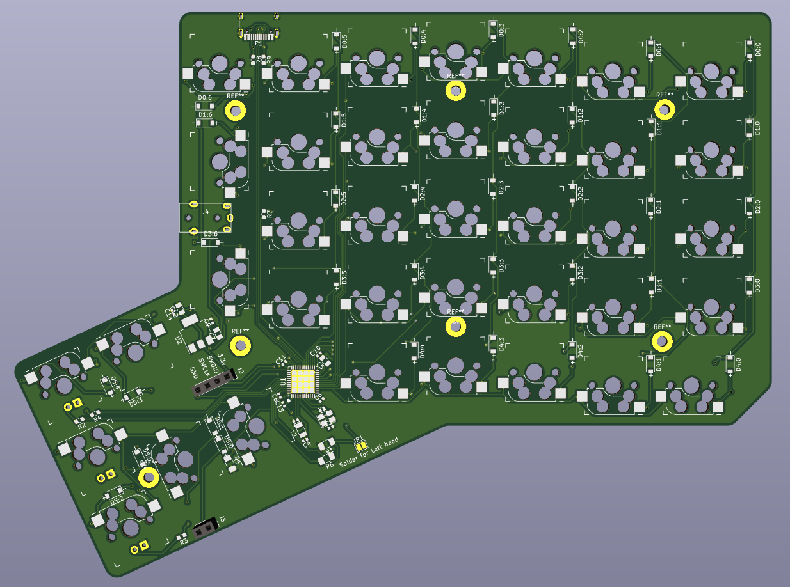

# Phoenix

Phoenix is inspired by [Ergodox](https://www.ergodox.io/), and add several improvements on it.

## Features

* A split ergonomic keyboard which fits the shape of the hands of human
* Improve the keyboard performance and response time of Ergodox by using dual controller
* Dual connectivity of both left and right hands can connect to USB host without re-program the mcu
* Use USB C connectors
* Use hotswap switch connectors to get rid of soldering
* A single PCB design for both left and right hand
* A more stable PCB mounting design
* Use parts that are can be obtained more easily

## How to build

Still in progress
